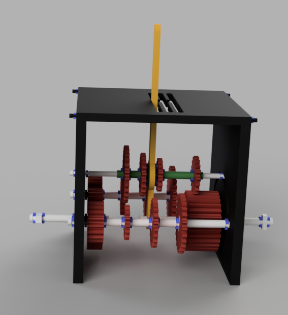

# Mechanical Transmission

A functional 3D-printable mechanical transmission With 6 speeds

---

---

Transmission components:
| Component | Quantity |
|-----------|----------|
| 15 tooth| 2|
| 18 tooth| 1|
| 19 tooth| 1|
| 20 tooth| 1|
| 22 tooth| 1|
| 26 tooth| 1|
| 27 tooth| 2|
| 31 tooth| 1|
| Side Gear| 2|
| Input gear|1|
| Output Gear| 1|
| Box face| 2|
| Top face| 1|
| Gear shifter| 1|
| Lever| 1|
| Input pipe| 1|
| Middle rod| 1|
| Output Pipe| 1|
| Side Rod| 2|
| retaining Ring 1mm| 4|
| retaining Ring 1.25mm| 4|
| retaining Ring 1.9mm| 32|
| retaining Ring 2.3mm| 6|
| retaining Ring 2.3mm large | 2|

Colors are unavailable on githup, see table.png

Demo: https://youtu.be/1IeM9q7GXE4